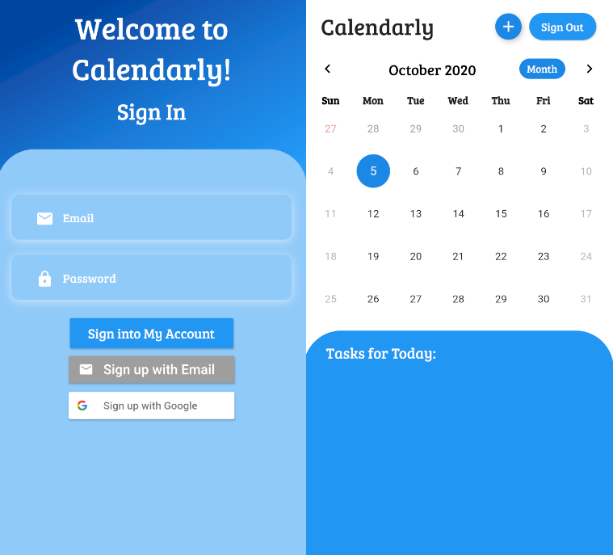

<h1 align="center"> Calendarly </h1>

## Table of Contents
[Introduction](#introduction)
[Developing](#developing)
[Screenshot](#screenshot)

## Introduction

Calendarly is a calendar app meant for the least tech-savvy of people. It is my first app made using Dart and Flutter.

## Developing

#### Built With
- [Flutter](https://flutter.dev/)
    - [table_calendar](https://pub.dev/packages/table_calendar)
- [Firebase](https://firebase.google.com/)

## Screenshot

